# 📊 **Multi-Cloud Data Integration with Azure Data Factory**

## 🚀 **Overview**

This project demonstrates a Multi-Cloud Data Integration Pipeline using **Amazon Web Services S3** for customer data storage **Microsoft Azure Blob Storage** for order data storage **Azure Data Factory** for orchestration and ETL **Snowflake** as the centralized cloud data warehouse.The solution extracts structured CSV files from two different cloud platforms and loads them into Snowflake for analytics and reporting.

This project is ideal for:

- Data Engineering portfolios
- Cloud integration demonstrations
- ETL/ELT learning
- Modern data warehouse architecture practice

---

## 📖 Business Problem

Companies use different cloud platforms to store data, which makes it hard to bring everything together, therefore,

In this project, we’ll take `customers` and `orders` data from **AWS S3** and **Azure Blob Storage** and move it into Snowflake Warehouse using Azure Data Factory (ADF) and Trigger. We will integrate data from both clouds into one place for the business analysis.

---

## 🏗️ **Architecture Overview**

```plaintext
1. AWS S3 (Customers Data)  →  Azure Data Factory  →  Snowflake Warehouse

2. Azure Blob Storage (Orders Data) →  Azure Data Factory  →  Snowflake Warehouse
```

---

## 🎯 Project Objectives

The main objectives of this project are:

- Build a cloud-native ETL pipeline
- Integrate multiple cloud platforms
- Automate data ingestion using Azure Data Factory
- Store centralized analytics data in Snowflake
- Demonstrate modern data engineering concepts

---

## 🧰 Technologies Used

| Technology         | Purpose                   |
| ------------------ | ------------------------- |
| AWS S3             | Store customers dataset   |
| Azure Blob Storage | Store orders dataset      |
| Azure Data Factory | ETL orchestration         |
| Snowflake          | Cloud data warehouse      |
| CSV Files          | Source datasets           |
| IAM User           | Secure AWS authentication |

---

## 📝 **Prerequisites**

To follow along, ensure you have:

✅ **AWS S3 Bucket** (For customer data)

- Creating S3 bucket `customers-data-s3-bucket`
- Uploading `customers.csv`

✅ **Azure Blob Storage** (For order data - `orders.csv`)

- Creating Container `orders`
- Uploading `orders.csv`

✅ **Snowflake Account**

- Create tables `customers` and `orders`

✅ **Azure Data Factory (ADF)**

- ADF Trigger (For scheduling and orchestration)

---

## 🛠️ **Step-by-Step Implementation**

### 🔹 **Step 1: Create AWS S3 Bucket and Upload File**

1. Go to **AWS Dashboard** → **S3** → Click `Create bucket`.

2. Enter a unique name, e.g., `customers-data-s3-bucket`, and enable "Block all public access".

3. Click `Create Bucket`.
   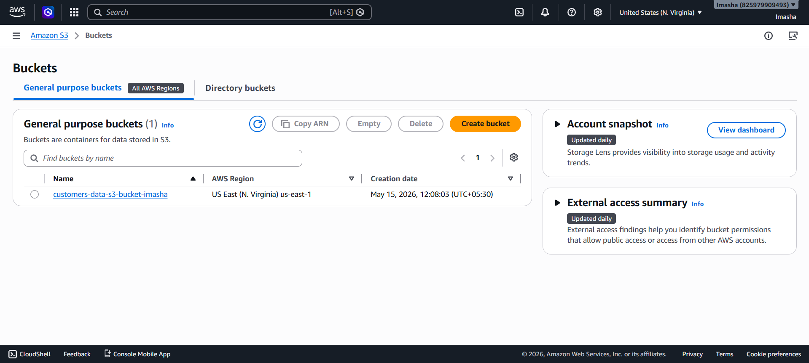

4. Upload the `customers.csv` file into the bucket.
   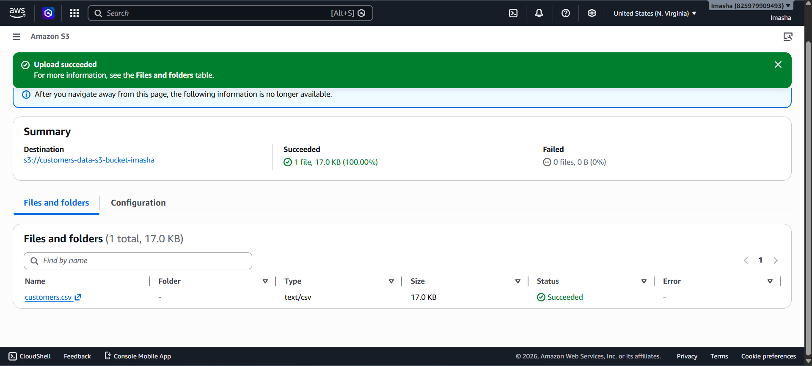

### 🔹 **Step 2: Configure IAM User for ADF Access to S3**

- To access the bucket from ADF(3rd Party), we have to create an IAM user credentials and assign a permission to it. So,

1. Go to **AWS IAM Console** → Create a new IAM user (`adf-s3-access-user`).

2. Select Attach policies directly option.

3. Attach policy `AmazonS3ReadOnlyAccess`.
   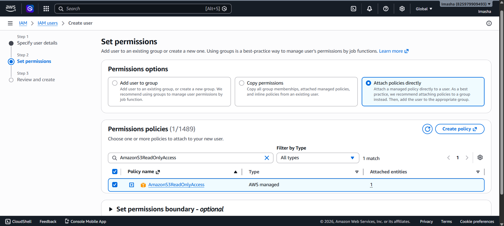
   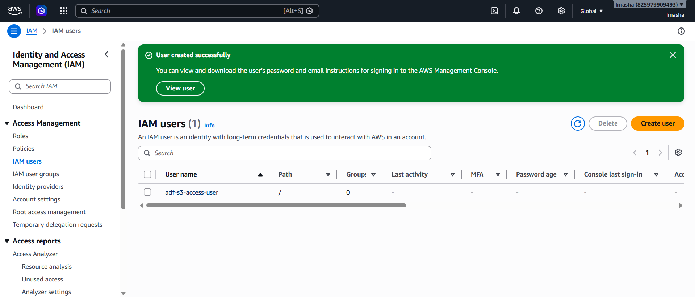

4. Select **adf-s3-access-user** the one you just created, Next, Go to the **Security credentials** tab and scroll to **Access Keys** section, then click **Create access key** and select ‘Third-party service’, and save the ‘Access Key’ and ‘Secret Access Key’ or download the csv file for your better.
   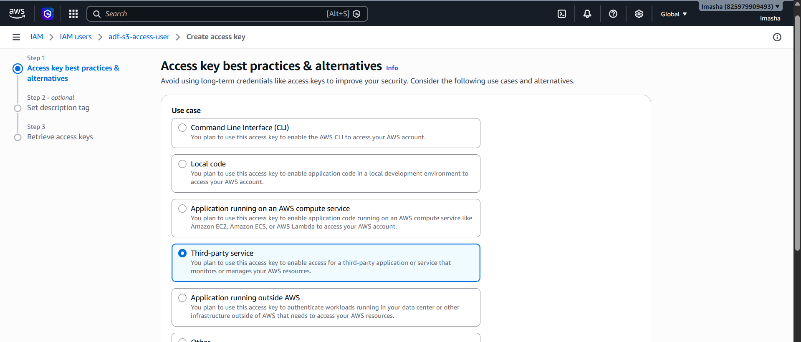
   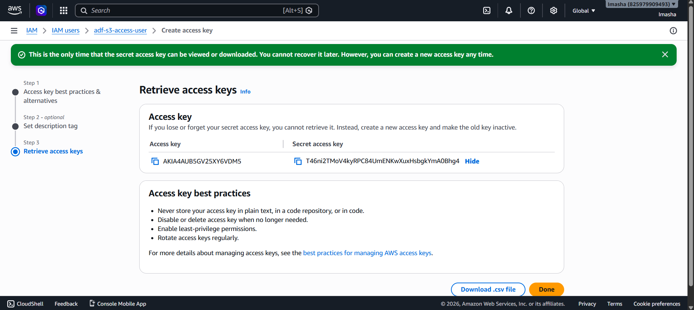

### 🔹 **Step 3: Create Azure Blob Storage and Upload File**

1. Create a **Storage Account** (`awsazstorageac`).

2. Create a **Container** named `orders`.
   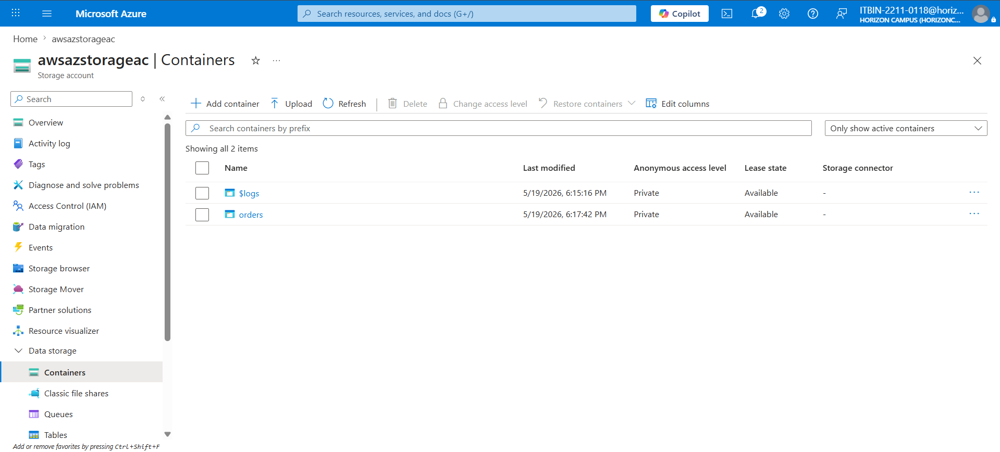

3. Upload `orders.csv` into the `orders` container.
   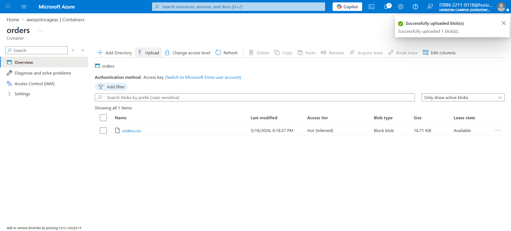

### 🔹 **Step 4: Set Up Snowflake (Data Warehouse)**

1. **Create Database:**
   ```sql
   CREATE DATABASE SALES_DB;
   ```
   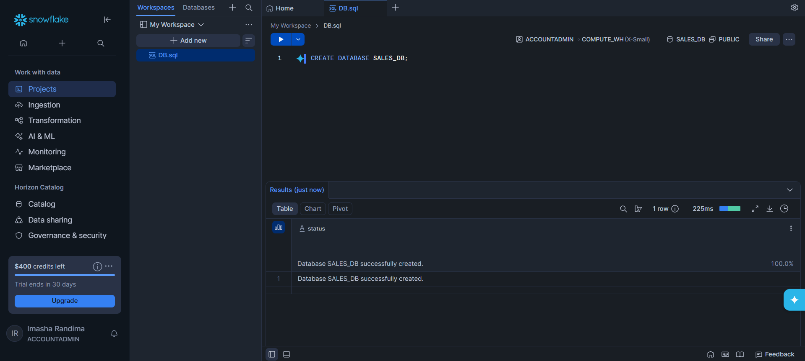
2. **Create Schema:**

   ```sql
   CREATE SCHEMA SALES_DB.SALES_SCHEMA;
   ```

   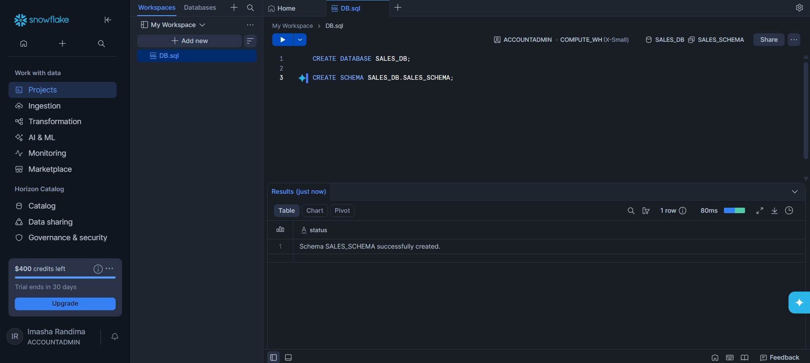

3. **Create Tables:**

   ```sql
   CREATE TABLE SALES_DB.SALES_SCHEMA.CUSTOMERS (
   CUSTOMER_ID INT PRIMARY KEY,
    FIRST_NAME VARCHAR,
    LAST_NAME VARCHAR,
    EMAIL VARCHAR,
    PHONE VARCHAR,
    ADDRESS VARCHAR
   );

   CREATE TABLE SALES_DB.SALES_SCHEMA.ORDERS (
    ORDER_ID INT PRIMARY KEY,
    CUSTOMER_ID INT,
    ORDER_DATE DATE,
    TOTAL_AMOUNT FLOAT,
    QUANTITY INT,
    FOREIGN KEY (CUSTOMER_ID) REFERENCES SALES_DB.SALES_SCHEMA.CUSTOMERS(CUSTOMER_ID)
   );

   ```

   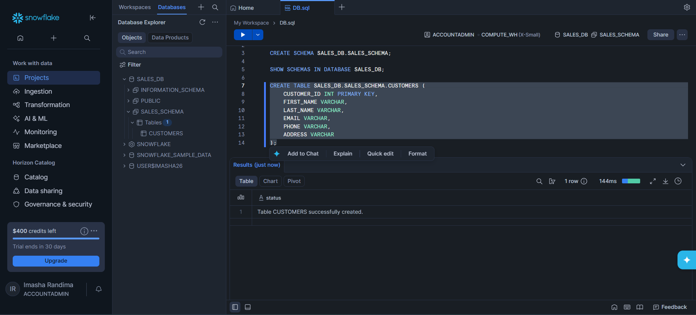
   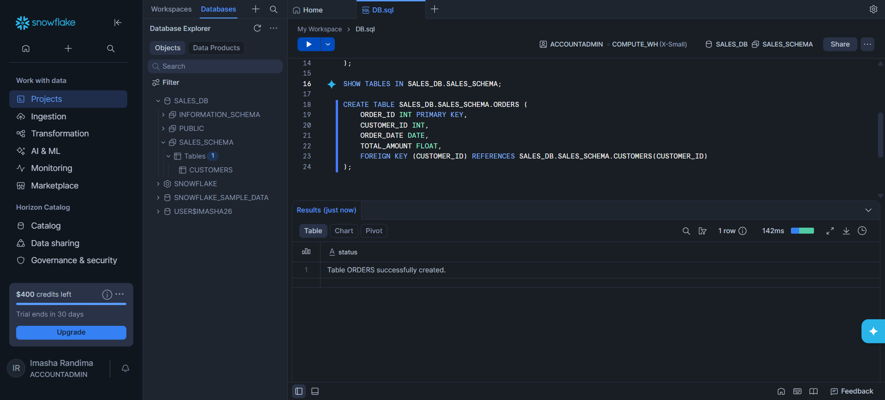

---

## 🔗 **Step 5: Configure Linked Services in ADF**

- Linked Services act like connection strings between ADF and external systems.

- Navigate to the Azure dashboard, find Data Factory, and create a new data factory named 'cross-cloud-integration.'

  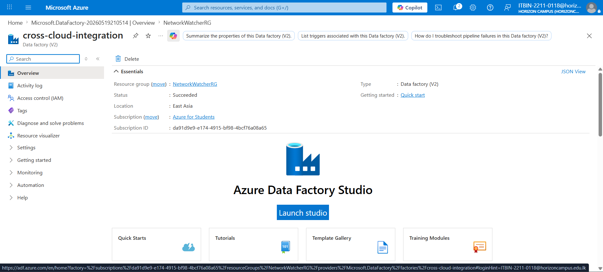

### 5a: Create Linked Service for AWS S3

1. Go to **Azure Data Factory Studio** → **Manage** → **Linked Services** → `+ New`.

2. Search and Select **Amazon S3**, enter `Access Key ID`, `Secret Access Key`, `Bucket Name`, and `Region`.

3. Click `Test Connection`, then `Create`.

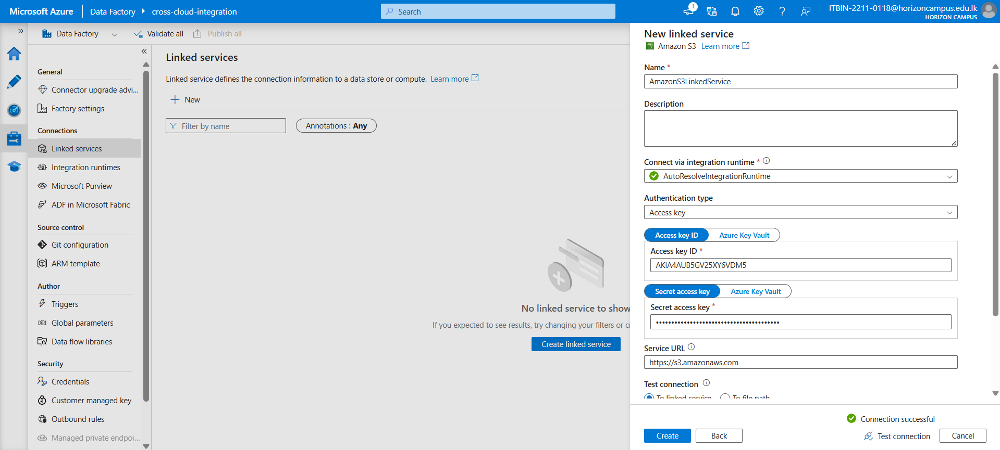

### 5b: Create Linked Service for Azure Blob Storage

1. Go to **Azure Data Factory Studio** → **Manage** → **Linked Services** → `+ New`.

2. Select **Azure Blob Storage** → name it as `AzureBlobLinkedService` and select Authentication type **Account Key** and enter the previous storage account name that created `awsazurestorageac`.

3. Click `Test Connection`, then `Create`.

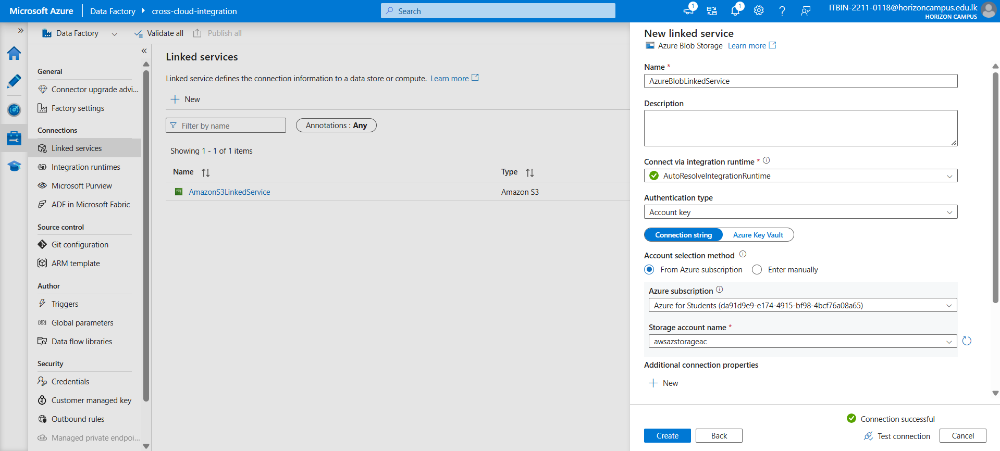

### 5c: Get the Details for Create Linked Service for Snowflake

1. To find Account Name, Go to Snowflake Dashboard → Profile → Account → View Account Details, then Copy ‘Account Identifier’ and past in Account Name.

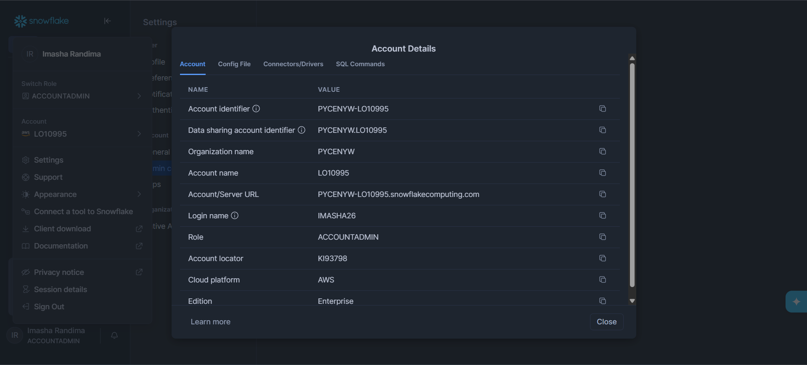

2. To find Warehouse, Database Name, Schema Name, Go to Snowflake Dashboard → workspaces → open previous created worksheet, then all details is displayed on the right corner.

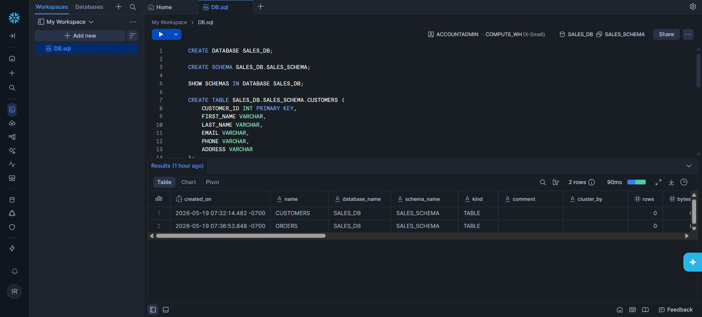

3. User Name and Password are the one you used to login to Snowflake.

### 5d: Create Linked Service for Snowflake

1. Go to **Azure Data Factory Studio** → **Manage** → **Linked Services** → `+ New`.

2. Search for Snowflake and select it. Then, name it as ‘SnowflakeLinkedService’, select name, `Account`, `Database`, `Schema`, `Warehouse`, `Authentication type`, and `User name`, and `Password` then, Click ‘Test connection’ then Create.

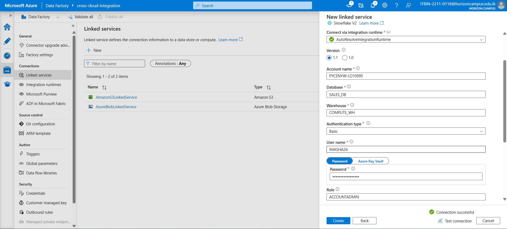

---

## 📂 **Step 6: Create Datasets in ADF**

### 6a: Create Dataset for AWS S3 Customers Data

1. Go to **Azure Data Factory Studio** → **Author** → **Datasets** → `+ New`.

2. Search & select **Amazon S3** → select **Delimited Text**.

3. fill in all the information as shown in below screenshot and Click OK.

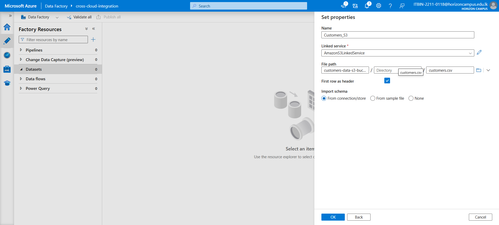

### 6b: Create Dataset for Azure Blob Orders Data

1. Go to **Azure Data Factory Studio** → **Author** → **Datasets** → `+ New`.

2. Search & select **Azure Blob Storage** → select **Delimited Text**.

3. fill in all the information as shown in below screenshot and Click OK.

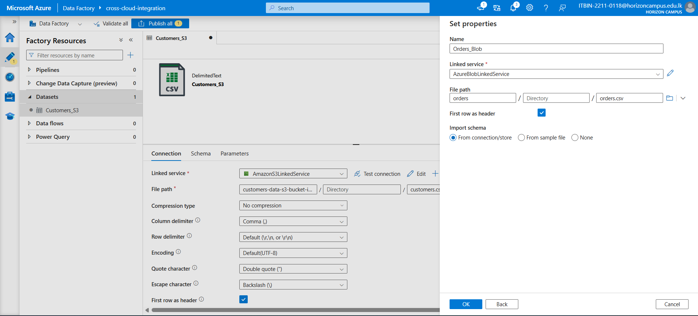

### 6c: Create Dataset for Snowflake

1. Go to **Azure Data Factory Studio** → **Author** → **Datasets** → `+ New`.

2. Search & select ** Snowflake** → enter Name `Customers_Snowflake` → Select ‘SnowflakeLinkedService’ → Select Table name **Customers** then Click OK.

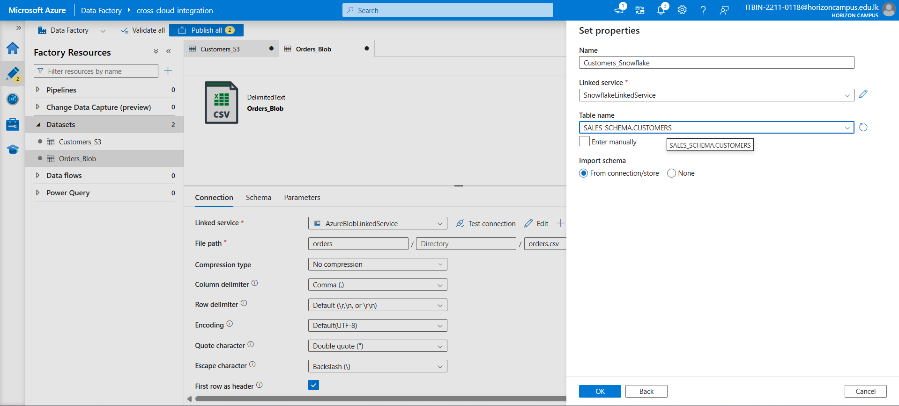

3.  Repeat the same steps and create another Datasets with name `Orders_Snowflake` and select **Orders** table in Table Name.

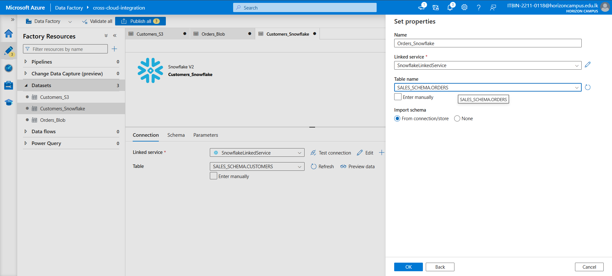

---

## 🔀 **Step 7: Build the ADF Pipeline**

1. Go to Azure Data Factory Studio → **Author** → **Pipelines** → `+ New Pipeline` → Name it `S3_n_Azure_Blob_to_Snowflake` →
   Add **Copy data** activity as shown below.

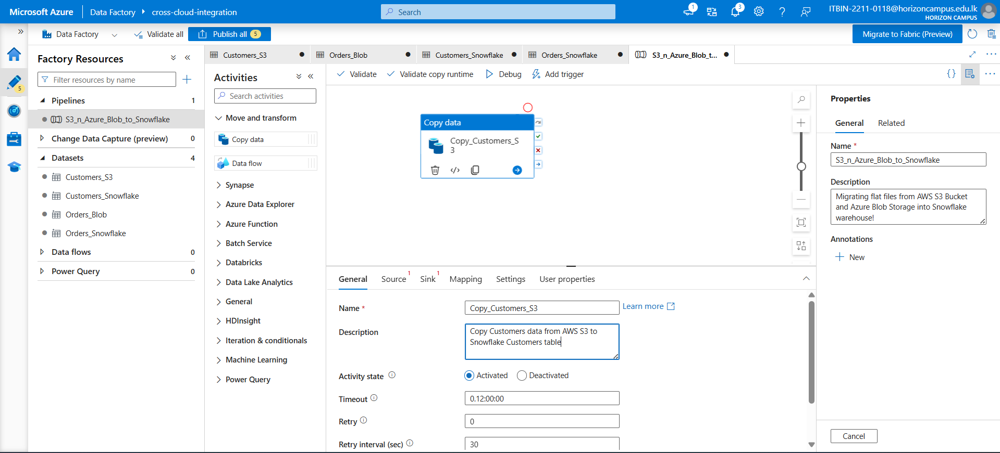

2. Add Copy Data Activity for Customers Data. Under **Source tab**, Select `Customer_S3`.


3. Under **Sink tab**, Select `Customer_Snowflake`.

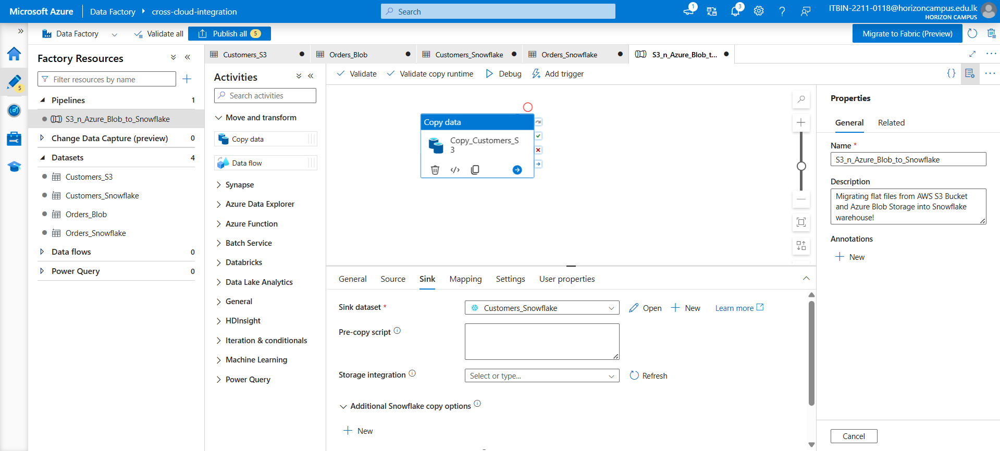

4. Under **Mapping tab**, Schemas should be imported if not import it and make sure it’s mapped properly.

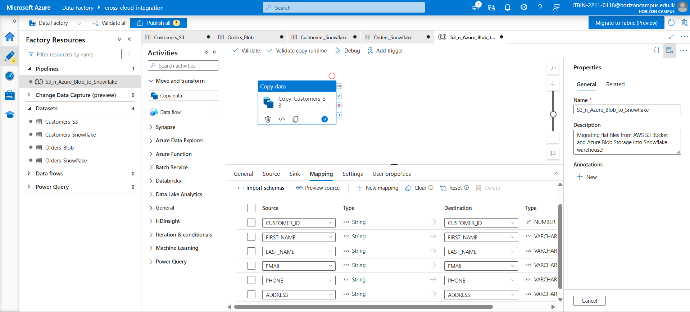

5. Now, go to Azure dashboard → resource group → select your container → Data storage → Containers → + Containers,
   name it as `staging`.

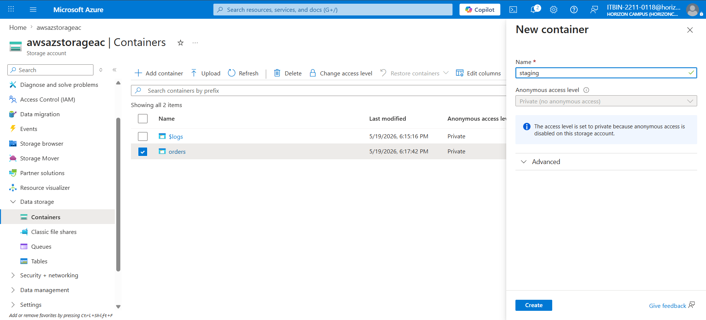

6. Now click & open the container `staging` the one you just created, then click on → **Shared access tokens** → select
   **read, Write, and List permissions**, then select → Start and expiry date/time → now Click on **Generate SAS token and URL**.

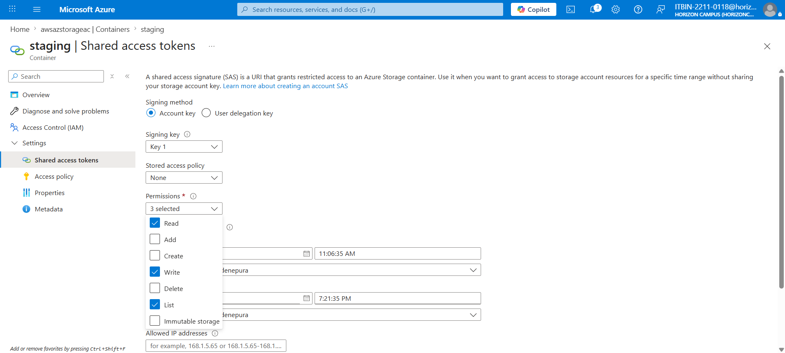

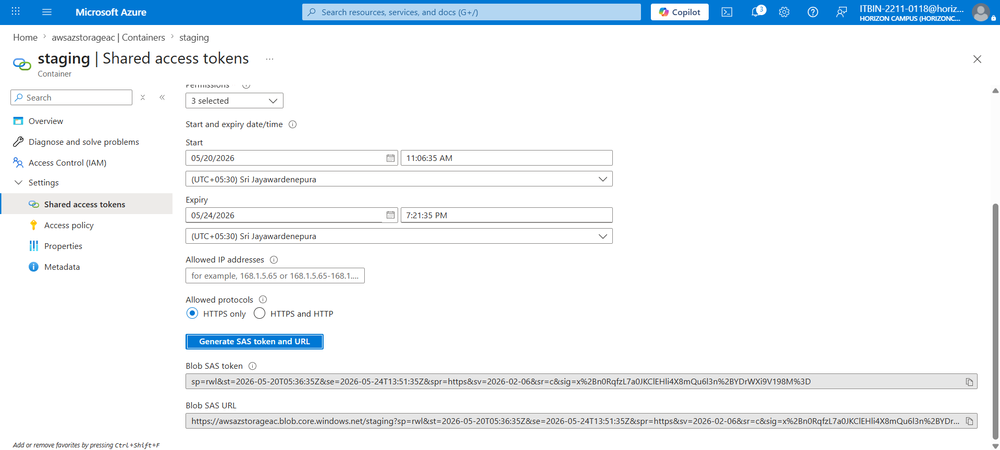

7. Copy **Blob SAS token, Blob SAS URL** and store them somewhere as you will not be able to access it later.

8. Now, Return to the Azure Data Factory tab. Under Settings→ ensure Enable staging is selected → enter **Storage path** as `staging` → Click `+ New`, name it `Ls_staging_blob_storage`, and choose SAS URI for authentication type. Paste the Blob SAS URL (saved earlier refer to page no 24) into the SAS URL field → Click on Test connection if success click on ‘Create’ else re confirm the SAS URL properly.

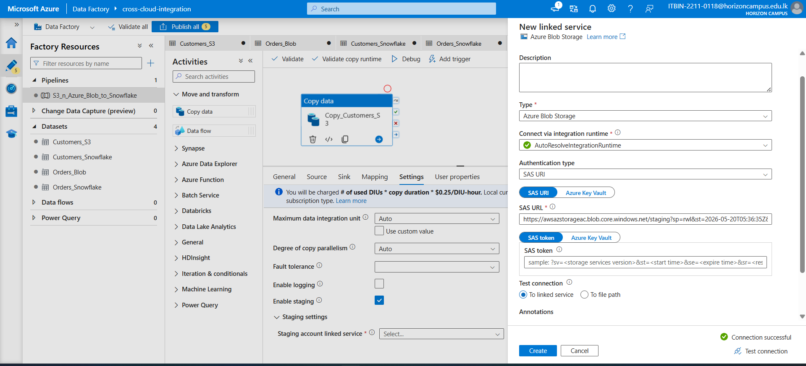

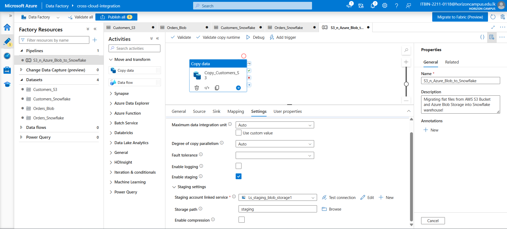

9. **Now**, Click on **Publish all** and save the changes.

10. Similarly add another **Copy Data** activity for **Orders Data**. Under **Source tab**, Select `Orders_Blob`

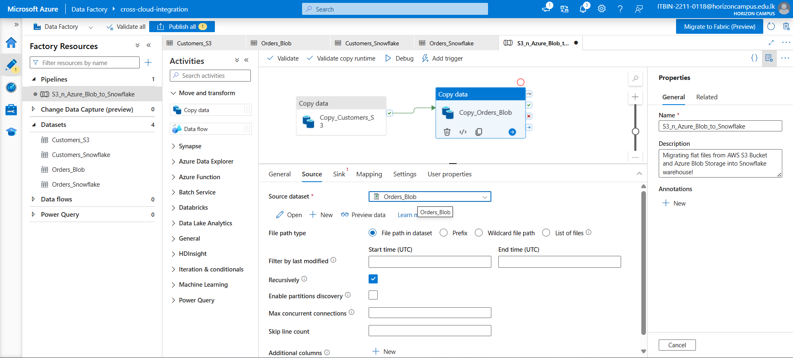

11. Under **Sink tab**, Select `Orders_Snowflake`

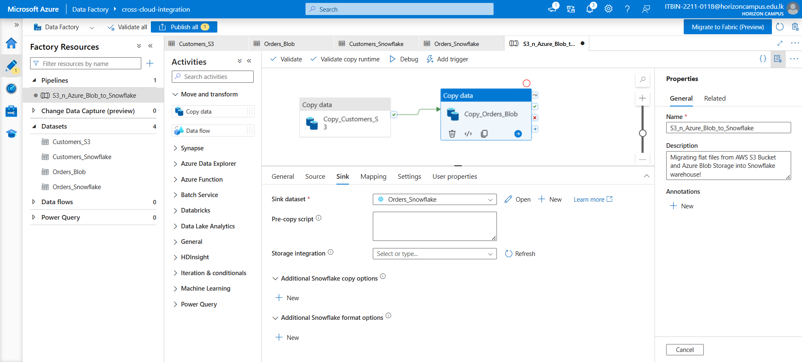

12. Under **Mapping tab**, Schemas should be imported if not import it and make sure it’s mapped properly.

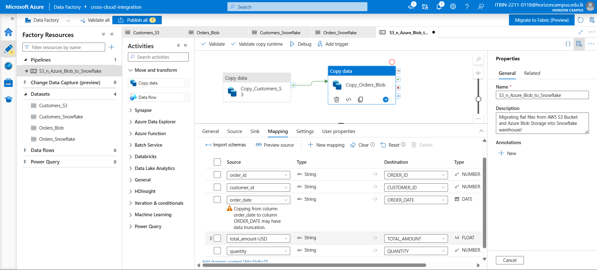

13. Under Settings → ensure **Enable staging** is selected → enter `Storage path` as staging → Select `Ls_staging_blob_storage`
    → Test connection if success click on **Publish all**.

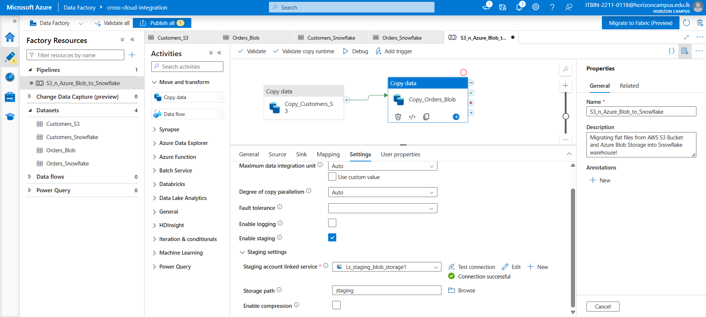

---

## ⏳ **Step 8: Create ADF Trigger**

1. **ADF Studio** → **Author** → Select **Pipeline** → Click **Add Trigger**.

2. Configure schedule as needed. Click `Publish & Test`.

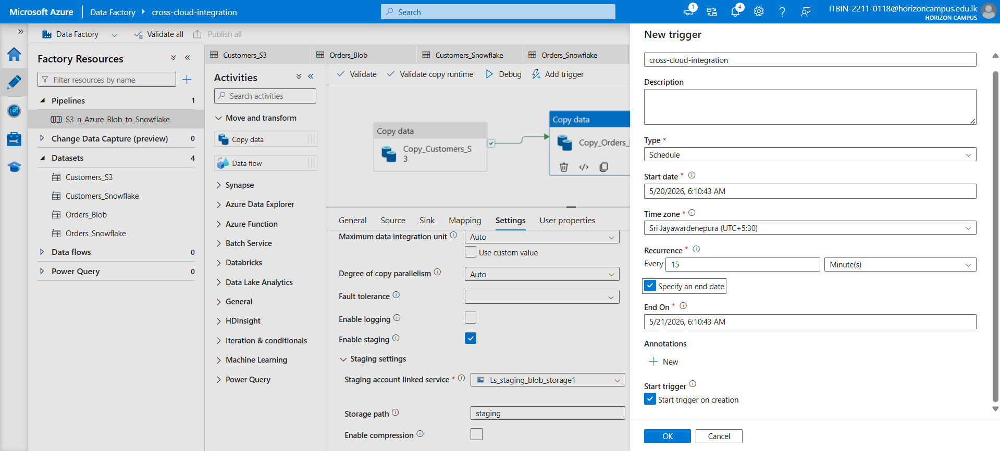

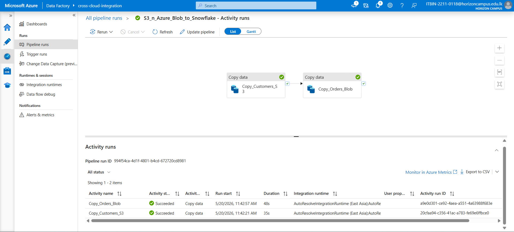

---

## ✅ **Step 9: Validate Data in Snowflake**

- Verify Customers Table

```sql
SELECT * FROM SALES_DB.SALES_SCHEMA.CUSTOMERS;
```

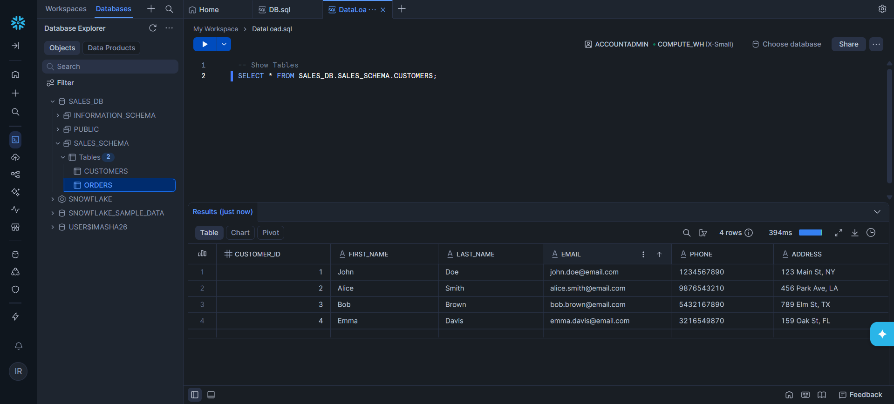

- Verify Orders Table

```sql
SELECT * FROM SALES_DB.SALES_SCHEMA.ORDERS;
```

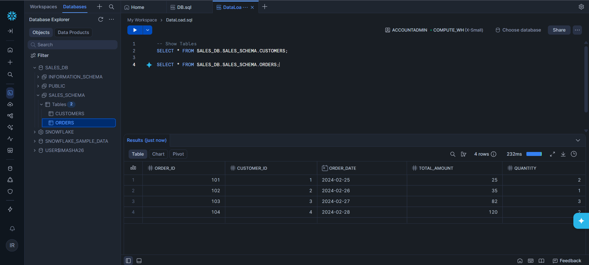

---

## 📢 **Conclusion**

This project showcases how to integrate data across multiple cloud platforms using **Azure Data Factory**, moving customer and order data from **AWS S3 & Azure Blob Storage** into **Snowflake**. The end result is a **unified, cloud-agnostic data pipeline** that enables seamless data ingestion and business analytics.

---
